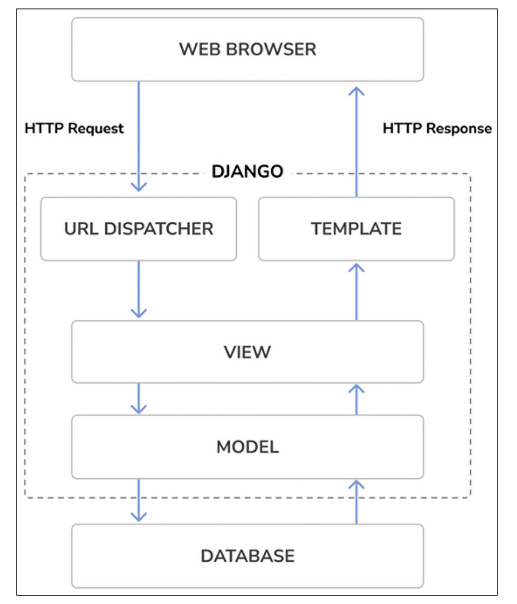

# Django Overviews

## Main Framework Components

Django follows MTV Design Pattern.

Model - Template - View (MTV) are divided as follow:

- **Model**: This define the logical data structure and is the data handler between database and view.
- **Template**: This a presentation layer.
- **View**: This communicate with database via the Model and transfers the data to the template for viewing.
- The framework itself is act as a **controller**.

## Simple overview of Django architecture

Django request/response cycle with different main Django components - URLs, views, models, and template.

[<< previews](./1-What-is-Django.md) | [Next >>](./3-Django-Imports.md)